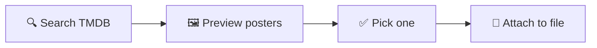

<p align="center">
  
</p>

<p align="center">
  
  
  
  
</p>

<p align="center">
  Search TMDB, pick a poster, embed it in the file. That's the whole tool.
</p>

---

## What it does

Local media libraries lose their posters the moment you stop running a media server. mak-attatch skips the server entirely — it fetches the artwork from TMDB once and writes it straight into the video file as an attachment. Move the file, rename it, copy it to another drive: the poster goes with it, because it never lived anywhere else.



It ships two interfaces on top of the same core logic:

- a **PyQt6 desktop GUI**, for browsing a library visually
- a **Textual TUI**, for headless boxes and SSH sessions, with a `yazi` file picker built in

---

## Features

- TMDB search across movies and TV, with a full poster grid and preview before you commit
- Batch mode — attach one poster to many files, or strip posters from many at once
- Metadata embedding: title, year, overview, genres, rating, and cast — native Matroska tags on MKV, ffmpeg tags on MP4/MOV
- Local image posters, if you'd rather not pull from TMDB
- Filename parsing guesses the title and year before you type anything
- Format-aware: MKV is edited in place, MP4/MOV go through ffmpeg, everything else gets converted to MKV first

---

## Install

**AUR**
```bash
yay -S mak-attatch
```

**From source**
```bash
git clone https://github.com/dougbug589/mak-attatch
cd mak-attatch
sudo make install
```

**No install, just try it**
```bash
git clone https://github.com/dougbug589/mak-attatch
cd mak-attatch
./setup.sh
.venv/bin/python main.py       # GUI
.venv/bin/python poster-tui    # TUI
```

Grab the system packages from [Requirements](#requirements) first.

## Usage

**GUI** — `mak-attatch`
Enter your key on first run, then browse for a file or type a title and search. Double-click a result, pick a poster from the grid, hit Attach. Drag-and-drop and batch selection work from the same window.

**TUI** — `mak-attatch-tui`
Same flow, keyboard-driven. <kbd>Ctrl</kbd>+<kbd>F</kbd> opens `yazi` for multi-file selection; <kbd>Tab</kbd> cycles between the search, results, posters, and files panels.

---

## How each format is handled

| Format | Attach | Remove |
|---|---|---|
| MKV | `mkvpropedit --add-attachment` | `mkvpropedit --delete-attachment` |
| MP4 / MOV | ffmpeg, `attached_pic` disposition | ffprobe detect → ffmpeg remux |
| Anything else | Converted to MKV, then attached | Converted to MKV, then removed |

## Requirements

| | |
|---|---|
| Python | 3.10+ |
| ffmpeg | MP4/MOV attach & remove |
| mkvtoolnix-cli | `mkvpropedit`, for MKV |
| TMDB API key | free, prompted on first launch |

TUI adds `python-textual`, plus optional `yazi` and `chafa` for file browsing and terminal poster previews.

```bash
# Arch
sudo pacman -S python python-pyqt6 python-requests python-guessit ffmpeg mkvtoolnix-cli
sudo pacman -S python-textual yazi chafa

# Debian/Ubuntu
sudo apt install python3 python3-pyqt6 python3-requests python3-guessit ffmpeg mkvtoolnix

# Fedora
sudo dnf install python3 python3-pyqt6 python3-requests python3-guessit ffmpeg mkvtoolnix
```

---

## No app? There's a script for that

`convert.sh` runs the same attach/remove logic from a plain bash prompt — no Python involved, just ffmpeg and mkvtoolnix.

```bash
./convert.sh
```

## Structure

```
mak-attatch/
├── main.py             # GUI entry point
├── poster-tui           # TUI entry point
├── poster_tui/app.py     # TUI application — imports core/ directly, no duplicated logic
├── ui/                    # PyQt6 desktop GUI
├── core/                  # Shared TMDB client, attach/remove logic, filename parser
├── config.py               # API key storage (~/.config/mak-attatch/)
├── convert.sh               # Standalone bash utility
├── tests/                    # Test suite
└── .github/workflows/         # CI + CodeQL
```

## Tested, not just reviewed

A test suite covers the attach/remove logic directly, CI runs on every push, CodeQL scans for known vulnerability patterns, and Dependabot keeps dependencies current. None of that replaces actually running the app against real files — it just means the basics don't regress silently.

## Security

API keys are never sent as URL parameters, config is locked to your user account only, and every subprocess call uses argument lists — never a raw shell string. Found an issue? See [SECURITY.md](SECURITY.md).

---

## License

MIT — see [LICENSE](LICENSE).
