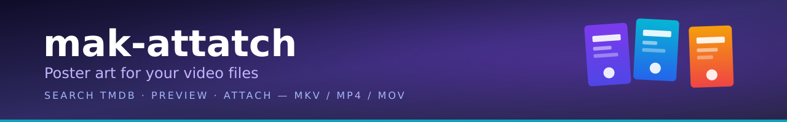

<p align="center">
  
</p>

<p align="center">
  Search <b>TMDB</b> for movie &amp; TV posters · <b>preview</b> them · <b>embed</b> cover art straight into your video files.<br>
  <b>MKV</b> is native — <b>MP4</b>, <b>MOV</b> &amp; <b>AVI</b> are converted automatically.
</p>

<p align="center">
  
  
  
  
  
  
  
  
</p>

<p align="center">
  <a href="#features">✨ Features</a> ·
  <a href="#quick-start">⚡ Quick start</a> ·
  <a href="#usage">🚀 Usage</a> ·
  <a href="#keyboard-shortcuts">⌨️ Shortcuts</a> ·
  <a href="#the-story">🎞️ The story</a> ·
  <a href="#requirements">📦 Requirements</a>
</p>

---

## ✨ Features

| | | | |
|---|---|---|---|
| 🎬 **TMDB search** — movies & TV with full poster selection | 🖼️ **Poster preview** — full-res preview before attaching | 📦 **Batch attach** — add many files, one poster attaches to all | 🧹 **Batch remove** — strip art & metadata in one go |
| 🧠 **Smart parsing** — title & year auto-detected from filenames | 📚 **Metadata embed** — optional title/overview/genres/cast tags | 🖌️ **Local images** — use any JPEG/PNG as a poster | 🧊 **Format-safe** — MKV stays MKV, MP4 stays MP4 |
| 🖥️ **Two interfaces** — desktop GUI (PyQt6) or terminal TUI (Textual) | 🏝️ **Self-contained art** — lives *in* the file, survives moves, works offline | 🧩 **yazi integration** — multi-select files straight from the TUI | 🏠 **No server needed** — no NAS, no always-on box, no scraper |

### How it works

<p align="center">
  <code>Type a title</code> &nbsp;→&nbsp; <code>Search TMDB</code> &nbsp;→&nbsp; <code>Preview posters</code> &nbsp;→&nbsp; <code>Pick one</code> &nbsp;→&nbsp; <code>Attach</code>
</p>

> Art is embedded **inside** the file, so it travels with the video — rename, move, back it up, copy it to a USB stick, and the poster stays put.

---

## ⚡ Quick start

**Arch (AUR)**
```bash
yay -S mak-attatch
```

**From source**
```bash
git clone https://github.com/dougbug589/mak-attatch
cd mak-attatch
sudo make install
```

**Try it without installing**
```bash
git clone https://github.com/dougbug589/mak-attatch
cd mak-attatch
./setup.sh
.venv/bin/python main.py       # desktop GUI
.venv/bin/python poster-tui    # terminal TUI
```

**Uninstall**
```bash
sudo make uninstall
```

Install the system dependencies from [Requirements](#requirements) first.

---

## 🚀 Usage

### 🖥️ Desktop GUI

```bash
mak-attatch
```

1. Enter your TMDB API key on first launch
2. **Browse** for a video file, or **type** a movie/show name and search
3. **Double-click** a result to browse its posters
4. **Click** a poster to preview, then select it
5. Hit **Attach Poster**

> Drag-and-drop files, batch mode and local image posters are all supported.

### ⌨️ Terminal TUI

```bash
mak-attatch-tui
```

1. Enter your TMDB API key on first launch
2. **Search** for a movie or TV show
3. Press `Enter` to load posters
4. **Arrow keys** to navigate, `Enter` to preview
5. Press `Enter` again to close, then **Attach Poster**

**Browse (yazi):** press `Ctrl+F` to open yazi, mark several files with `Space`, press `Enter` — all of them land in the files panel. Multiple paths can also be pasted (newline- or space-separated) or typed in.

---

## ⌨️ Keyboard shortcuts (TUI)

| Key | Action |
|---|---|
| `Tab` / `Shift+Tab` | Cycle panels forward / backward |
| `Ctrl+L` | Jump to **Search** panel |
| `Ctrl+M` | Jump to **Posters** panel |
| `Ctrl+R` | Jump to **Files** panel |
| `Ctrl+F` | Open **yazi** file browser |
| `Ctrl+Q` | Quit |

Panels cycle in order: Search → Results → Posters → Files → Buttons.

> The GUI uses standard desktop shortcuts — `Ctrl+O` to open files, `Ctrl+V` to paste, and so on.

---

## 🎞️ The story

> This tool was born out of necessity. There wasn't the budget or the hardware for a proper media server, so the collection just lives on local drives. Kodi handled the library view, but it pulls posters over the network and caches them server-side — and the scrapers would fail or grab the wrong poster for a file. Half the time the library ended up looking worse than a plain file browser.
>
> Manual attachment via `mkvpropedit --add-attachment` worked — the thumbnail showed up right in the file browser. But typing those flags out for every single file got old fast, and between re-downloading posters and guessing which one matched, it was still a chore.
>
> mak-attatch is a small tool that puts it all in one place: search TMDB, preview the posters, attach with one click. The art gets embedded *inside* the file, so it moves with the video, works offline, and no server or scraper has to be running to keep the library looking right.

---

## 📦 Requirements

| Dependency | Version | Notes |
|---|---|---|
| Python | 3.10+ | |
| ffmpeg | latest | MP4/MOV poster attach & remove |
| mkvtoolnix-cli | latest | `mkvpropedit` for MKV |
| TMDB API key | free | Prompted on first launch; stored in `~/.config/mak-attatch/` |

**TUI extras:** `python-textual` (framework) · `yazi` (file browser, optional) · `chafa` (terminal poster preview)

```bash
# Arch
sudo pacman -S python python-pyqt6 python-requests python-guessit ffmpeg mkvtoolnix-cli
sudo pacman -S python-textual yazi chafa          # TUI extras

# Debian/Ubuntu
sudo apt install python3 python3-pyqt6 python3-requests python3-guessit ffmpeg mkvtoolnix

# Fedora
sudo dnf install python3 python3-pyqt6 python3-requests python3-guessit ffmpeg mkvtoolnix
```

---

## 🔧 How it works per format

| Format | Attach | Remove |
|---|---|---|
| **MKV** | `mkvpropedit --add-attachment` | `mkvpropedit --delete-attachment` |
| **MP4/MOV** | `ffmpeg -disposition:v:1 attached_pic` | ffprobe detect + ffmpeg remux strip |
| **Other** (AVI, etc.) | Convert to MKV, then attach | Convert to MKV, then remove |

> **Metadata:** tick **Scrape metadata** to embed title, year, overview, genres, rating and cast (Matroska tags for MKV, ffmpeg tags for MP4/MOV). **Remove Metadata** strips the segment title + tags while keeping the poster. Re-attaching always overwrites stale tags.

---

## 🔑 API key

Get a free key at [themoviedb.org/settings/api](https://www.themoviedb.org/settings/api). Both apps prompt for it on first launch. Stored in:

```
~/.config/mak-attatch/config.json
```

---

## 🧰 Standalone utility

No app? `convert.sh` attaches or removes a poster from a single file:

```bash
./convert.sh
```

Prompts for add/remove mode, video path and an optional poster image. Handles format conversion and attachment natively.

---

## 📁 Project structure

```
mak-attatch/
├── main.py              # Desktop GUI entry point
├── poster-tui           # Terminal TUI entry point
├── poster_tui/          # TUI application
│   ├── app.py
│   └── core/
│       ├── tmdb.py      # TMDB API client
│       ├── attacher.py  # MKV/MP4 attachment logic
│       └── parser.py    # Title extraction from filenames
├── ui/                  # PyQt6 desktop GUI
├── core/                # Shared core modules
├── config.py            # Root-level configuration
├── convert.sh           # Standalone bash utility
├── requirements.txt     # Python dependencies
├── setup.sh             # Virtual environment setup
├── PKGBUILD             # Arch Linux package build
├── Makefile             # Install/uninstall targets
└── assets/              # Logos and screenshots
```

---

## 📄 License

[MIT](LICENSE)
